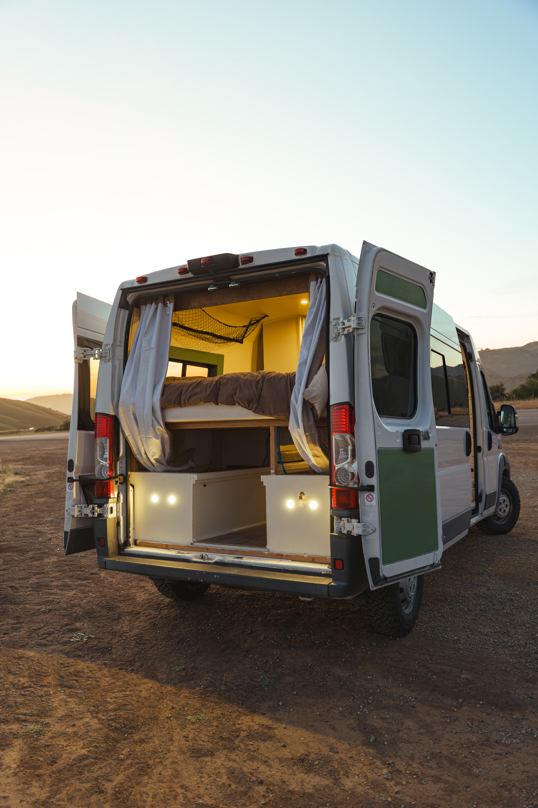
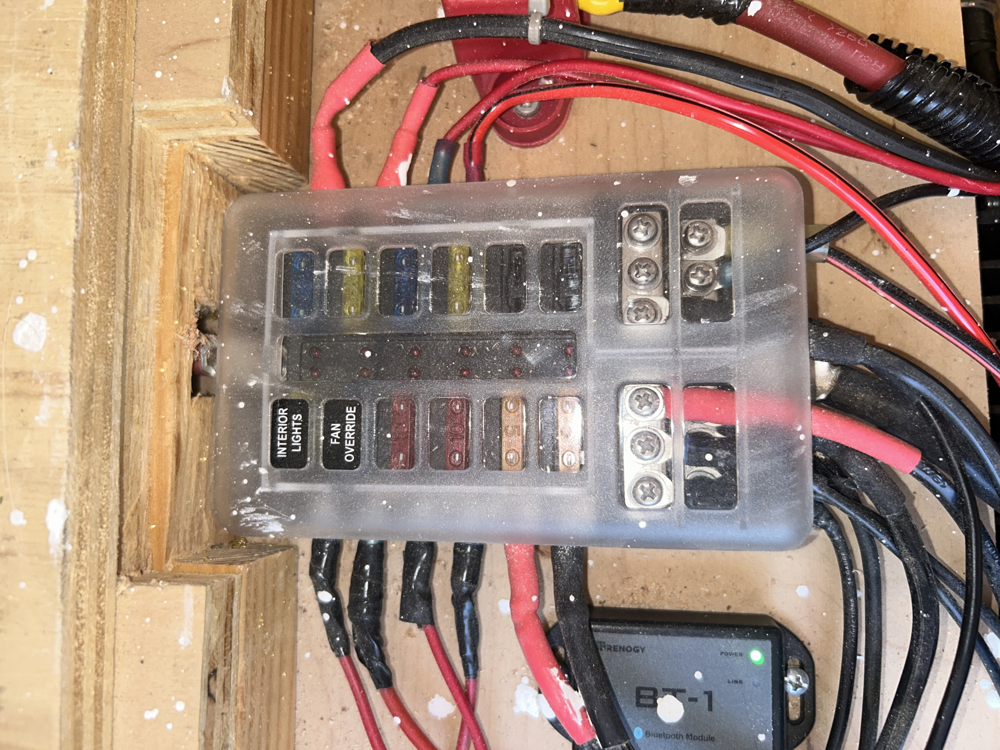
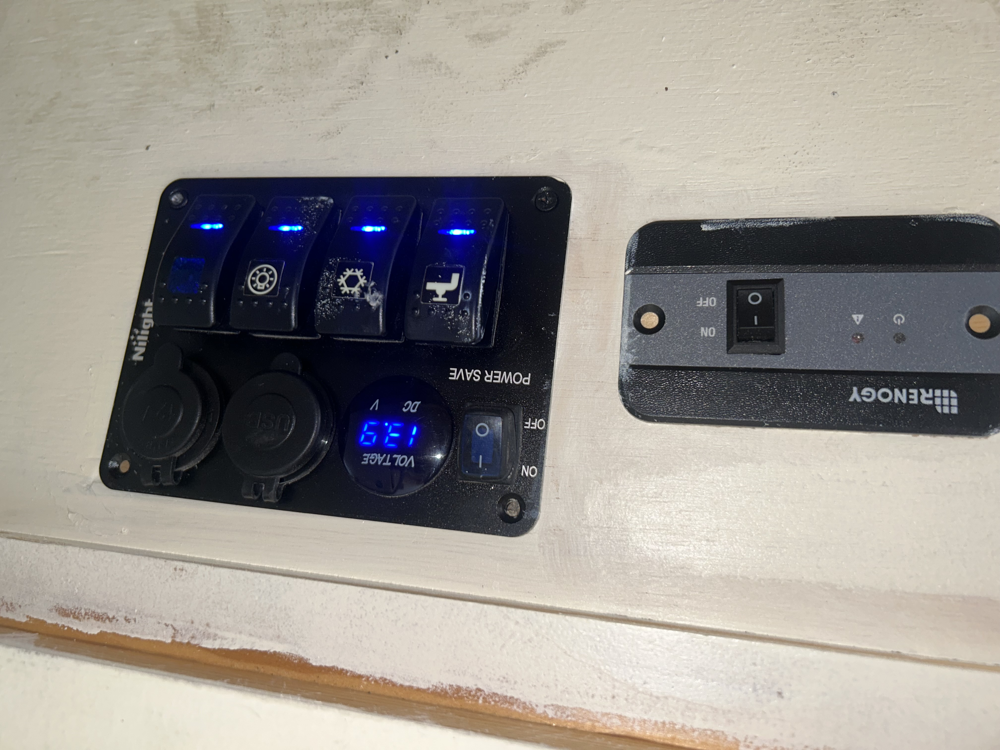
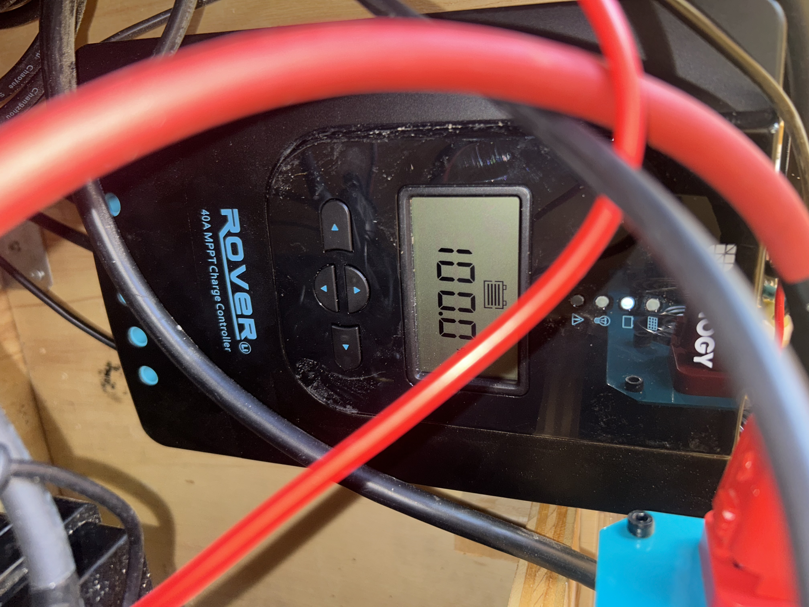
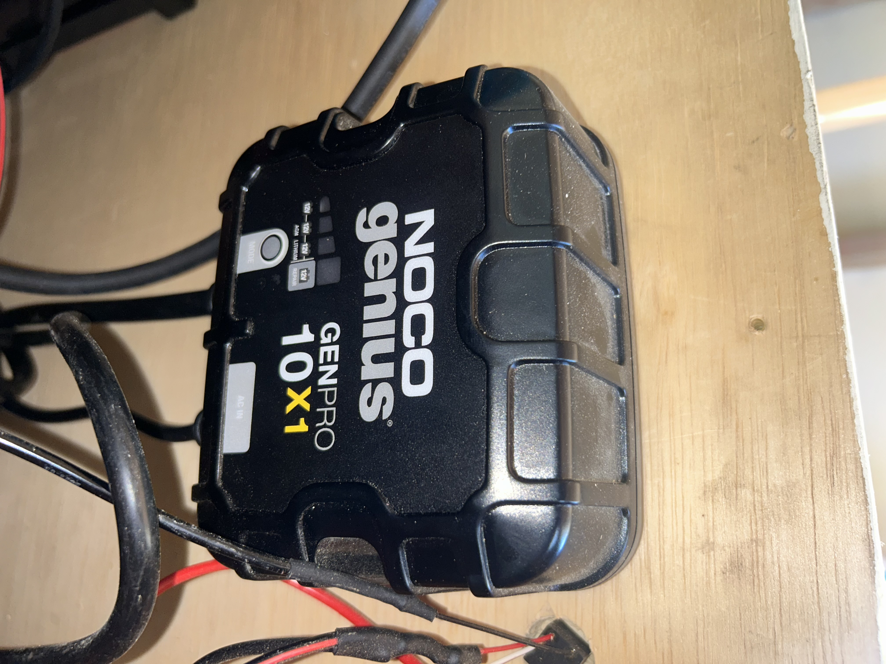
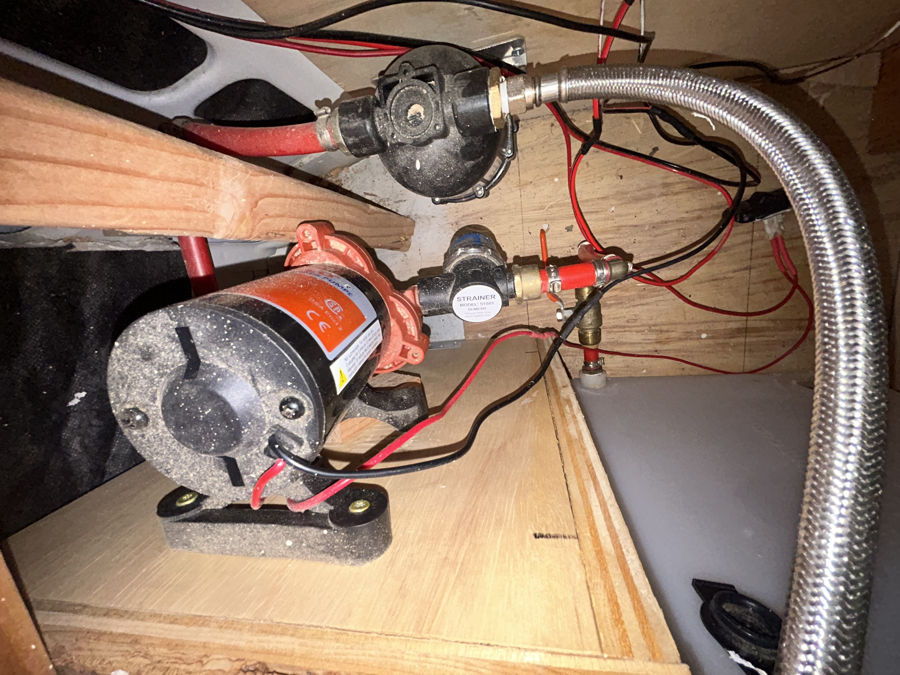

  
  

# Van Conversion Build

A full camper van conversion combining interior fabrication, 12V electrical power, solar charging, shore charging, plumbing, lighting, storage, and custom woodworking.

This project documents the process of building the van interior from the ground up, including the flooring, walls, ceiling, bed frame, storage, desk/work area, sink, plumbing, lighting, and electrical system.

## What This Build Includes

- Full camper van interior build
- Flooring, ceiling, wall panels, and wood framing
- Bed frame, storage, desk/work area, and seating
- Sink, water tanks, pump, plumbing, and drain setup
- Off-grid 12V electrical system
- Solar charging
- Shore power charging from a standard wall outlet
- 3000W inverter setup
- LiFePO4 house battery
- DC fuse/control panel
- AC and DC outlets
- Custom interior and exterior lighting
- Fridge, lights, pump, and accessory wiring
- Troubleshooting notes
- Build photos and progress updates

## Main Electrical Components

- 200Ah LiFePO4 house battery
- 3000W pure sine wave inverter
- Renogy Rover 40A MPPT solar charge controller
- NOCO 10A shore charger
- Solar panels
- DC fuse panel / control panel
- AC outlets powered by inverter
- DC outlets and 12V accessory wiring
- Water pump wiring
- Interior and exterior lights
- Fridge wiring
- Fuses, breakers, switches, and main wiring runs

## Electrical System

The van uses a 12V house battery system to power the lights, fridge, water pump, outlets, and accessories. The battery can be charged from solar power or from a standard wall outlet using the shore charger.

The system includes a 3000W inverter for AC power, a solar charge controller for off-grid charging, a fuse/control panel for protected DC loads, and separate wiring runs for the main accessories.

  
  
  

  <b>Battery + Inverter</b> &nbsp;&nbsp;&nbsp; <b>Fuse Box + Wiring</b> &nbsp;&nbsp;&nbsp; <b>Control Panel</b>

Main goals for the electrical system:

- Safe power distribution
- Clean wiring layout
- Fuse protection for each load
- Easy access for maintenance
- Reliable charging from solar or shore power
- Enough power for real use inside the van

## Charging System

The van can charge from both solar power and shore power. The solar charge controller handles off-grid charging, while the shore charger allows the battery to be charged from a standard wall outlet.

  
  

  <b>Solar Charge Controller</b> &nbsp;&nbsp;&nbsp; <b>Shore Power Charger</b>

## Plumbing

This section documents the water system, including the sink, water pump, tubing, fittings, drainage, and fixes made during the build.

  

Plumbing notes:

- Installed sink and countertop area
- Added fresh water storage
- Installed water pump
- Ran tubing to the sink
- Built drain line setup
- Tested for leaks
- Sealed around sink and plumbing areas
- Adjusted layout for easier access and maintenance

## Interior Build

The interior was built around making the van functional for sleeping, working, storage, and daily use.

Interior work included:

- Flooring installation
- Wall and ceiling panels
- Wood framing and mounting surfaces
- Bed frame and mattress area
- Desk/work area
- Seating/storage sections
- Sink counter and cabinet structure
- Fridge placement
- Interior lighting
- Finished wood surfaces and trim

## Photos

Photos are organized throughout the repository to show the build process, electrical layout, plumbing setup, interior progress, and final results.

~~~txt
photos/
photos/electrical/
photos/plumbing/
photos/interior/
photos/before-after/
~~~

## Things I Learned

- Plan wiring access before closing walls or panels
- Leave service room around electrical components
- Label wires early
- Test each electrical section before final installation
- Keep plumbing accessible for leak checks
- Interior layout matters as much as the electrical system
- Small design changes make a big difference once the van is being used

## Future Improvements

- Add cleaner wiring labels
- Add more detailed wiring diagrams
- Add more detailed plumbing diagrams
- Continue improving storage and service access
- Add more photos showing the full build process
